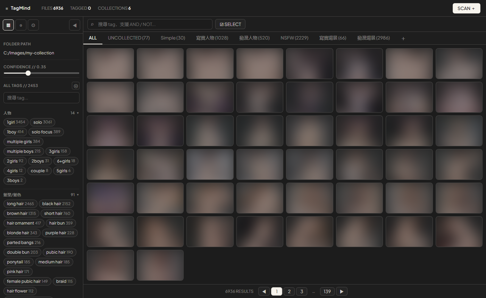
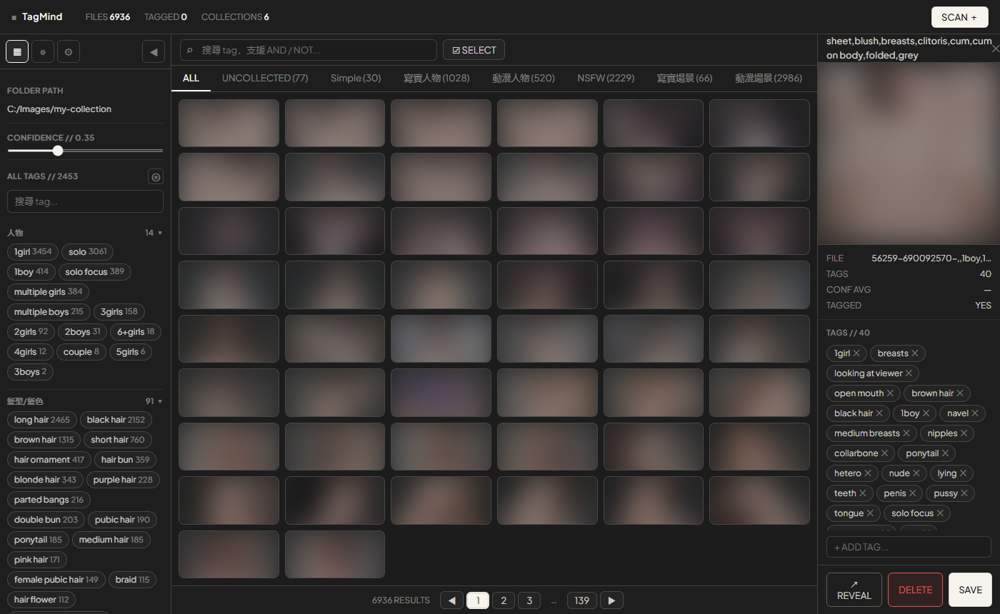
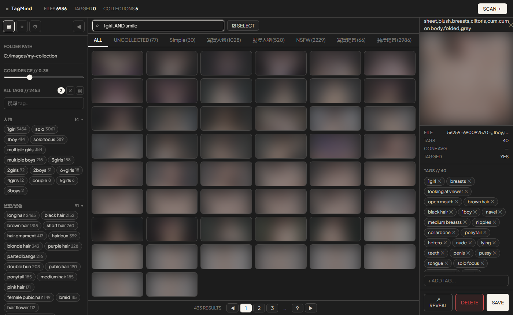
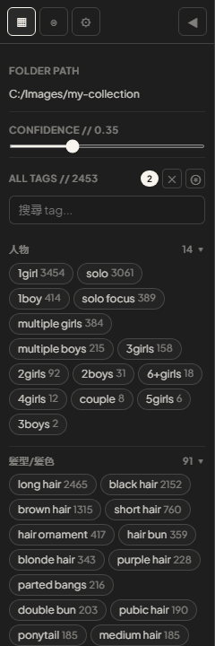

<div align="center">
  
  <h1>TagMind</h1>
  <p>本地 AI 圖片打標與管理工具 · Local AI Image Tagger & Browser</p>

  
  
  
  
</div>

---

TagMind 是一個完全本地運行的 AI 圖片打標與管理工具。掃描資料夾、AI 自動分析 tag、用關鍵字搜索、分類整理，全部在本機完成，不需要 API Key，不上傳任何資料。

---

## 介面預覽

**主畫廊** — 瀏覽所有圖片，左側為 Tag 分類面板，頂部可切換集合


**Detail Panel** — 點擊任意圖片展開側邊欄，查看完整 tag 清單並直接編輯


**搜索篩選** — 輸入 tag 關鍵字即時過濾，支援 AND 多條件與 NOT 排除


**Tag 側邊欄** — 依分類展示所有 tag 及出現次數，點擊即可篩選


---

## ✨ 功能特色

### AI 打標
- **WD-SwinV2-Tagger-V3** — 業界主流動漫圖像識別模型，首次啟動自動從 HuggingFace 下載（約 446 MB）
- **批次推理** — 可調整 batch size，NVIDIA GPU 約 3–8 張/秒
- **可調 threshold** — 控制 tag 輸出精確度，預設 0.35

### 搜索與篩選
- **AND 搜索** — `brown hair, smile` 逗號分隔，同時符合多個條件
- **NOT 排除** — `-nsfw` 加減號排除不想看到的 tag
- **Tag 面板** — 左側顯示目前集合內所有 tag 及出現次數，點擊即篩選
- **未打標篩選** — 快速找出尚未 AI 分析的圖片

### 集合管理
- **建立集合** — 將圖片分組（如：寫實人物、動漫人物、NSFW、場景…）
- **批次指定** — 選取多張圖片後一次移入指定集合
- **自動分類腳本** — `auto_classify.py` 根據 AI tag 自動將圖片分配到集合

### 選取與操作
- **多選** — 單擊選取、Shift 點擊範圍選取、滑鼠拖曳框選（Lasso）
- **右鍵選單** — 快速執行刪除、移動、加入集合等操作
- **批次刪除** — 可選擇同時刪除磁碟原始檔案
- **批次移動** — 將選取圖片移動到指定資料夾，資料庫路徑同步更新
- **在檔案總管定位** — 右鍵直接開啟原始檔案所在位置

### 介面體驗
- **Cyber 深色主題** — Plus Jakarta Sans 字型，完整重設計的 v2 UI
- **燈箱瀏覽** — 點擊圖片全螢幕顯示，左右鍵切換
- **Detail Panel** — 側邊欄顯示完整 tag 清單，可直接新增、刪除、儲存
- **掃描歷史** — 記錄曾掃描過的資料夾，一鍵重新載入
- **鍵盤快捷鍵** — 支援 `A` 全選、`Delete` 刪除、`Escape` 取消選取等
- **分頁瀏覽** — 每頁 50 張，大型資料夾流暢瀏覽

---

## 📋 系統需求

| 項目 | 需求 |
|------|------|
| 作業系統 | Windows 10 / 11 |
| Python | 3.10 以上 |
| 顯示卡 | NVIDIA GPU（建議）或 CPU 模式 |
| CUDA | 12.x（GPU 加速需要） |
| 磁碟空間 | 約 600 MB（含模型與虛擬環境） |

> **CPU 模式：** 不需要 CUDA，但打標速度約 0.5–1 張/秒。修改 `requirements.txt` 將 `onnxruntime-gpu` 換成 `onnxruntime` 即可。

---

## 🚀 安裝與啟動

### 步驟一：下載專案

```bash
git clone https://github.com/urbandecipher/TagMind.git
cd TagMind
```

### 步驟二：建立虛擬環境

```bash
python -m venv venv
venv\Scripts\activate
```

### 步驟三：安裝依賴

**GPU 模式（NVIDIA，需要 CUDA 12.x）：**
```bash
pip install -r requirements.txt
```

**CPU 模式（無 GPU 或不需要 GPU 加速）：**
```bash
pip install -r requirements.txt --extra-index-url https://download.pytorch.org/whl/cpu
# 或直接將 requirements.txt 中的 onnxruntime-gpu 改為 onnxruntime
```

### 步驟四：設定 config

```bash
copy config.json.example config.json
```

`config.json` 的內容（可按需修改）：
```json
{
  "last_folder": "C:/你的圖片資料夾",
  "threshold": 0.35,
  "theme": "cyber"
}
```

### 步驟五：啟動

```bash
start.bat
```

或直接執行：
```bash
python main.py
```

瀏覽器會自動開啟 `http://localhost:8000`。**首次啟動**會從 HuggingFace 下載模型（約 446 MB），請耐心等待。

---

## 📖 使用流程

### 基本流程

1. 啟動後在左側「資料夾」輸入圖片路徑，點「**掃描資料夾**」
2. 點「**開始打標**」，等待 AI 分析所有圖片
3. 用搜索框或左側 Tag 面板篩選圖片
4. 點擊任意圖片開啟 Detail Panel 查看或編輯 tag

### 搜索語法

| 範例 | 說明 |
|------|------|
| `brown hair` | 搜索含此 tag 的圖片 |
| `brown hair, smile` | 同時含兩個 tag（AND） |
| `1girl, -nsfw` | 含 1girl 但排除 nsfw（NOT） |
| 點擊 Tag 面板 | 直接篩選，可多選 |

### 集合管理

1. 左側「**集合**」區塊點「+」建立集合
2. 在圖庫中框選或 Shift 點選多張圖片
3. 右鍵 → 「加入集合」
4. 或執行 `python auto_classify.py` 讓程式根據 tag 自動分類

### 自動分類腳本

```bash
python auto_classify.py
```

預設會建立以下集合並自動分配已打標的圖片：

| 集合 | 分類依據 |
|------|---------|
| 動漫人物 | 含人物 tag（1girl, 1boy…），無明確寫實標記 |
| 寫實人物 | 含人物 tag + realistic/photo 等 tag |
| NSFW | 含任何 NSFW 相關 tag（優先判斷） |
| 寫實場景 | 無人物，含 realistic/landscape 等 |
| 動漫場景 | 無人物，含 scenery/no humans 等 |

執行後可在介面中手動微調分錯的圖片。

### 打包成 exe（選用）

```bash
pip install pyinstaller
python build.py
```

產生 `dist/TagMind.exe`，可在未安裝 Python 的電腦上執行。

---

## 🗂️ 專案結構

```
TagMind/
├── main.py              # FastAPI 後端，API 路由
├── tagger.py            # WD-SwinV2 ONNX 推理
├── database.py          # SQLite 資料庫操作
├── auto_classify.py     # 依 tag 自動分配集合的腳本
├── launcher.py          # PyInstaller 打包入口
├── build.py             # exe 打包腳本
├── fix_tags.py          # 資料庫 tag 格式修復工具
├── start.bat            # Windows 快速啟動
├── config.json.example  # 設定檔範本
├── requirements.txt     # Python 依賴
├── static/
│   ├── index.html       # 前端 HTML shell
│   ├── app.js           # 前端邏輯
│   ├── style.css        # 完整樣式表
│   └── icon.ico         # 應用程式圖示
└── docs/
    └── guide.html       # 詳細使用教程
```

---

## ⚙️ 常見問題

**Q: 第一次啟動沒有自動開啟瀏覽器？**
A: 手動開啟 `http://localhost:8000`，模型下載完成前後端不會回應。

**Q: 模型下載失敗或速度很慢？**
A: 可透過 HuggingFace 鏡像加速。在環境變數中設定：
```bash
set HF_ENDPOINT=https://hf-mirror.com
```

**Q: 想用 CPU 模式？**
A: 將 `requirements.txt` 中的 `onnxruntime-gpu` 改為 `onnxruntime`，重新 `pip install`。

**Q: 支援哪些圖片格式？**
A: JPG、PNG、WebP、GIF、BMP。

**Q: tag 都是英文，可以中文搜索嗎？**
A: 目前搜索為英文 tag 直接比對。WD-Tagger 輸出為英文，建議直接輸入英文 tag。

**Q: 資料存在哪裡？**
A: `tags.db`（SQLite）與 `thumbnails/`（縮圖快取），均在本機資料夾內，不上傳任何資料。

**Q: 刪除圖片後資料庫殘留？**
A: 執行 `python fix_tags.py` 清理無效記錄。

---

## 📄 授權

MIT License © 2026
